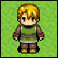
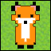
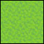
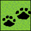
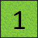
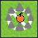
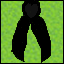
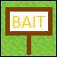
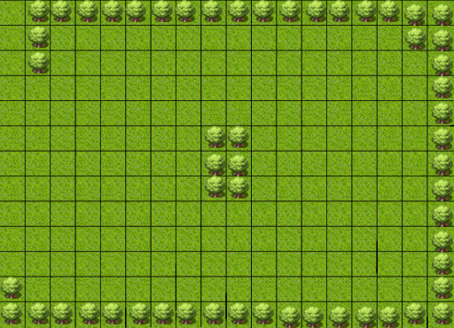
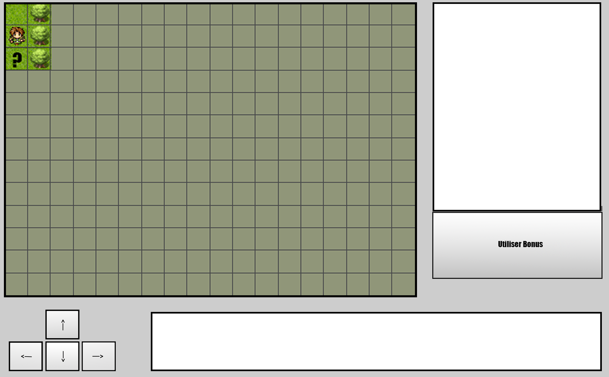

# La chasse au monstre

## Présentation

La chasse au monstre est un jeu se jouant a 0, 1 joueur contre l'ordinateur ou 2 joueurs en duel.

Il existe deux rôles jouables :
- Le chasseur :



- Le monstre :



Les deux joueurs apparaissent sur un plateau à deux endroits différant.

Chaque joueur a un objectif propre :
	
- La bête doit parcourir toutes les cases du plateau tout en ayant comme contrainte de ne pouvoir passer
qu'une seule fois sur chaque case du plateau. Elle a sa disposition un nombre de teleportation afin de l'aider en case
de blocage. Elle pourra voirs le casses sur lesquelles elle est deja passé grace au trace de pas laissé sur les cases :

<center>    </center>

- Le chasseur lui doit trouver la bête avec pour seule indiction, le temps écoule entre le passage de la bête 
et celui du chasseur sur les cases ou le chasseur passe. Les cases seront numerotées en fonction du temps écoulé.

<center>    </center>

### Les Bonus

Pour pimenter les parties nous avons également rajouter des objets collectable par les joueurs, pour aider à accomplir 
son objectif ou alors handicaper son adversaire. Nous avons également prévu plusieurs plateaux plus ou moins complexe 
pour ajouter de la difficulté et de la re jouabilité.

La disposition de ces pieges est situe sur la distance moyenne de chaque cote du plateau.

Voici la liste des objets disponible ainsi qu'un petit guide de leur utilisation :

- Les pieges :

<center> </center>
 
Seul le chasseur peut utiliser cet objet, le piege n'est pas visible par le monstre. Une information avec la position du piege
lorsqu'il est activ est disponible pour le chasseur si un intru se presente sur celle-ci. Le piege disparait ensuite.
La bete se voit privee de ses deplacements le tour suivant du deplacement sur la cage du piege.

- La balise de vision :

<center> </center>

Seul le chasseur peut utiliser cet objet, elle eclaire les huits cases autour d'elle et revele  le monstre si il passe dans son champs d'action,
Une fois activer la balises reste sur le terrain 3 tours mais peut etre detruite par le monstre si il passe dessus.

- Le camouflage :

<center> </center>

Seul le monstre peut utiliser cet objet, elle octroie a la bete la capacite d'effacer ses traces de pas a condition.
De ce fait, elle ne peut pas se deplacer durant ce tour.

- Les leurres :

<center> </center>

Seul le monstre peut utiliser cet objet, le monstre pose une copie de lui sur une case qui reste jusqu'au moment ou le chasseur passe
sur le casse ou est situe le leurre. Le leurre n'a pas de limite de temps.

## Utilisation

Lancer le jeu :

```
jeu.jar --width=20 --height=20 --tp=3 --gamemode=beast --map=circular --trap --camouflage --ward --bait
```

Voici les arguments disponible :

```
--width=XX           Modifie la largeur du plateau
--height=XX          Modifie la hauteur du plateau
--tp=XX              Indique le nombre de teleportation disponible pour le monstre durant une partie.
--gamemode=ZZ        Selection du mode de jeu avec pour ZZ les valeurs disponibles suivantes :
ai        : L'ordinateur joue contre lui meme et controle les deux entites.
beast     : Le joueur controle le monstre et l'ordinateur controle le chasseur.
hunter    : Le joueur controle le chasseur et l'ordinateur controle le monstre.
multi     : Un des deux joueurs controle le monstre et son adversaire controle le chasseur.

--map=AA
carre     : Un plateau de jeu rectangulaire ou carre selon la largueur/hauteur.
circular  : Un plateau de jeu circulaire selon la largueur/hauteur.

--trap               Active les pieges sur le plateau
--camouflage         Active les camouflages sur le plateau
--ward               Active les balises de vision sur le plateau
--bait               Active les leurres sur le plateau
```

Voici les arguments lances par defaut :


```java
jeu.jar --width=11 --height=11 --tp=3 --gamemode=beast --map=carre 
```
	
## Developpement


### Gestion de projet

Trello est l'outil qui nous permet de definir les futures taches a repartir parmi les membres de l'equipe.
L'outil nous permet de nous definir des sous-jalons 
[Lien](https://trello.com/b/s4kqkszi/gdp-s2).

Journal de bord du projet et premiere reflexion sur l'architecture du projet : 
[Lien](https://docs.google.com/document/d/1dkxMliuccb0sJ5Aa55jqOZho3DUbD6qv2GQvYVswOF4/edit?usp=sharing)

Estimation des heures sur le projet :
[Lien](https://docs.google.com/spreadsheets/d/1WuWRMOKtEFklpOo74Tn_29-D8dcVBh5htOClASj9DFM/edit#gid=1856470417)

<div align="center">
  <a href="https://www.youtube.com/watch?v=Mmu9JZva8hE"></a>
</div>

### Aspects techniques

Des le depart du projet, nous avons pense l'architecture pour que le jeu soit évolutif et facilement.

De ce fait, nous avons organisé notre code sous forme de package regroupant les fonctionnalités lie au nom du package.

- Au niveau gameplay, nous pouvons facilement créer de nouvelle maps dans le répertoire map.

- Nous pouvons également créer aisément de nouvelles IA dans le package `ai.algorithm` qui peut librement utiliser le package `ai.graph`

- Nous avons aussi une perspective de retenir le score pour plus tard dans le projet avec le package `data.score` 

- Egalement, le jeu contient a la fois le code pour etre lance en mode textuel et visuelle sans importante réécriture du code.

Pour le moment, le jeu implemente deux algorithme pour les IA :

- Dijkstra : Afin que le chasseur se deplace le plus rapidement vers sa cible.

- Kruskal : Afin de parcourir tout le plateau plateau.

## IHM

Pour l'interface homme machine nous avons décidé de diviser notre intreface en trois. Tous d'abord la partie centrale  de l'écran qui affichera la monde  ou le joueuer devra se deplacer, la partie inférieur de l'écran qui elle, aura a charge de gerer les action de l'utilisateur et de pouvoir lui communiquer des informations et la partie droite de l'ecran qui elle aura pour but d'afficher les bonus et de pouvoir les selectionner.

<div align="center">
	
	
</div>

- La partie inférieur de l'écran :

L'utilisateur pourra diriger le personne qui incarne (Chasseur/Bête) grace aux quatres boutons  marquer chaqu'un d'un fleche indiquant le mouvement que peut faire l'utilisateur
	
Une boite de texte est également présente afin d'informer l'utilisateur de certain details de la partie comme l'activation d'un bonus, le nombre de tour que la bête est passé sur la case ou encore sa victoire ou sa defaite.


- La partie droite de l'écran :

L'utilisateur devra utiliser la souris pour selectioner l'un de ses bonus qui s'affichera dans la boite de texte puis valider son utilisation en appuyant sur la bouton "Utiliser Bonus".	
	
	
## Contributeurs
- FORESTAL Virgil (diazw)
- PEIRERA Nathanael (nath)
- MAYEUX Pierre (PHPierre)
- PROGNON Quentin (prognonq)